# Ignite 2.18 模块依赖图（Module Dependency Graph）

> Primary source：`vendors/ignite/`（Apache Ignite 2.18.0 官方源码 submodule，只读）。
> 本文所有结论均来自实际打开的 `pom.xml` 与源码包结构，每个关键结论附文件路径。
> 研究方法：根 `pom.xml` 的 `<modules>` 清单定全集 → 逐个模块打开其 `pom.xml` 提取 `org.apache.ignite`（含 `${project.groupId}`）内部依赖 → 结合 `src/main/java` 包结构与关键类确认职责 → 用 core 中的 `IgniteComponentType` 验证运行时可选组件机制。

---

## 1. 模块总清单

证据：`vendors/ignite/pom.xml`（根 POM，`<modules>` 共 **39 项**，另有 profile 激活的模块）。

### 1.1 默认构建的 39 个模块

| # | Maven 模块路径 | artifactId | 一句话职责（证据：pom + 包结构） |
|---|---|---|---|
| 1 | `modules/checkstyle` | ignite-checkstyle | 构建期 checkstyle 规则与 suppressions |
| 2 | `parent` | ignite-parent | 全局 parent POM（版本/插件管理，无代码） |
| 3 | `parent-internal` | ignite-parent-internal | 内部 parent POM，`import` ignite-bom |
| 4 | `modules/bom` | ignite-bom | Bill of Materials，集中声明全部发布 artifact 的版本 |
| 5 | `modules/tools` | ignite-tools | 构建/javadoc/测试工具（ant task、junit listener、classgen） |
| 6 | `modules/commons` | ignite-commons | 无依赖的基础库：异常体系、`IgniteFuture`/`IgniteUuid`、JSR-166 并发容器、线程/工具类 |
| 7 | `modules/binary/api` | ignite-binary-api | Binary 对象公开 API（`BinaryObject`/`BinaryReader/Writer`、marshaller 接口）+ CacheObject 抽象 |
| 8 | `modules/binary/impl` | ignite-binary-impl | Binary marshaller 实现（`BinaryReaderExImpl`/`BinaryWriterExImpl`/`BinaryThreadLocalContext`） |
| 9 | `modules/unsafe` | ignite-grid-unsafe | sun.misc.Unsafe 封装（`GridUnsafe`、offheap 内存、`GridUnsafeDataInput/Output`） |
| 10 | `modules/core` | ignite-core | **内核主体**：Ignition/IgniteKernal、42 个 processor 包、SPI、discovery/communication、thin client（4241 个 .java） |
| 11 | `modules/compress` | ignite-compress | 页面压缩 processor 实现（zstd/lz4/snappy + posix native FS） |
| 12 | `modules/dev-utils` | ignite-dev-utils | 开发者工具（控制脚本等，`org.apache.ignite.development.utils`） |
| 13 | `modules/direct-io` | ignite-direct-io | 直接 I/O（绕过 page cache 的存储读路径） |
| 14 | `modules/extdata/p2p` | ignite-extdata-p2p | P2P 类加载的示例外部数据 jar |
| 15 | `modules/extdata/uri` | ignite-extdata-uri | URI deployment 的外部数据 jar（内嵌 `modules/uri-dependency` 子模块） |
| 16 | `modules/extdata/platform` | ignite-extdata-platform | .NET/Cpp platform 测试用外部数据 jar |
| 17 | `modules/extdata/pluggable` | ignite-extdata-pluggable | 可插拔组件外部数据 jar |
| 18 | `modules/clients` | ignite-clients | 客户端**互操作/QA 测试套件**（只有 `src/test/java`，无生产代码） |
| 19 | `modules/spring` | ignite-spring | Spring 集成（`IgniteSpringHelperImpl`、Spring 资源注入、XML 启动） |
| 20 | `modules/web` | ignite-web | Web 会话缓存（`org.apache.ignite.cache.websession`）+ servlet 启动器 |
| 21 | `modules/urideploy` | ignite-urideploy | URI deployment SPI（`spi.deployment.uri`） |
| 22 | `modules/indexing` | ignite-indexing | SQL 查询引擎之一：H2 引擎（`IgniteH2Indexing`，218 个 .java） |
| 23 | `modules/json` | ignite-json | JSON/management dump 序列化支持（Jackson 封装） |
| 24 | `modules/rest-http` | ignite-rest-http | HTTP REST 协议处理器（`processors/rest`） |
| 25 | `modules/jta` | ignite-jta | JTA 事务集成（`cache.jta` + CacheJtaManager） |
| 26 | `modules/log4j2` | ignite-log4j2 | Log4j2 日志适配器（`logger.log4j2`） |
| 27 | `modules/slf4j` | ignite-slf4j | SLF4J 日志适配器（`logger.slf4j`） |
| 28 | `modules/jcl` | ignite-jcl | Jakarta Commons Logging 适配器（`logger.jcl`） |
| 29 | `modules/codegen` | ignite-codegen | 旧版代码生成器（Message 源码生成） |
| 30 | `modules/codegen2` | ignite-codegen2 | 注解处理器：`MessageProcessor`/`IgniteDataTransferObjectProcessor`（编译期生成消息序列化代码） |
| 31 | `modules/zookeeper` | ignite-zookeeper | ZooKeeper discovery SPI（`spi.discovery.zk`） |
| 32 | `modules/web/ignite-appserver-test` | ignite-appserver-test | 应用服务器集成测试（web 模块配套） |
| 33 | `modules/web/ignite-websphere-test` | ignite-websphere-test | WebSphere 集成测试 |
| 34 | `modules/kubernetes` | ignite-kubernetes | K8s IP finder（`spi.discovery.tcp.ipfinder.kubernetes`）+ TCP 通信探测 |
| 35 | `modules/sqlline` | ignite-sqlline | SQLLine CLI 分发包（无 Maven 依赖、无生产代码，只有 bin/licenses） |
| 36 | `modules/opencensus` | ignite-opencensus | OpenCensus tracing SPI 实现 |
| 37 | `modules/control-utility` | ignite-control-utility | 控制脚本 `control.sh|bat`（`internal.commandline`：persistence 工具等） |
| 38 | `modules/calcite` | ignite-calcite | SQL 查询引擎之二：Apache Calcite 引擎（434 个 .java） |
| 39 | `modules/compatibility` | ignite-compatibility | 版本兼容性测试套件 |

### 1.2 profile 激活的模块（非默认构建）

证据：`vendors/ignite/pom.xml` 的 `<profiles>`（`all-java` / `ducktests` / `numa-allocator` / `build-dotnet`）：

| 模块 | artifactId | 职责 |
|---|---|---|
| `examples` | ignite-examples | 示例代码 |
| `modules/benchmarks` | ignite-benchmarks | JMH 基准测试 |
| `modules/ducktests` | ignite-ducktests | Python ducktests 测试框架 |
| `modules/numa-allocator` | ignite-numa-allocator | NUMA 绑定内存分配器 |
| `modules/schedule` | ignite-schedule | Cron 调度 processor（`IgniteScheduleProcessor`） |
| `modules/yardstick` | ignite-yardstick | Yardstick 性能基准框架 |
| `modules/platforms/dotnet` | ignite-dotnet | .NET 平台构建（`packaging=pom`，Java 侧仅拉 ignite-core/indexing/spring 供 .NET 测试用） |

另：`modules/platforms/cpp` 为纯 CMake 工程（C++ 客户端/ODBC，不参与 Maven 构建，见 `modules/platforms/cpp/CMakeLists.txt`）；`modules/platforms/dotnet` 下的 `Apache.Ignite.Core` 等为 .csproj 工程。

---

## 2. Maven 依赖图（Mermaid）

**箭头方向约定：`A --> B` 表示 A 依赖 B（A 的 pom.xml 里声明了对 B 的 `<dependency>`，箭头指向被依赖方）。**
只画**运行时依赖**（compile / provided scope）；`test` scope 依赖不画（如几乎所有模块对 ignite-tools 的 test 依赖）。`provided` 边用虚线标注，因为 binary/commons/unsafe 最终会被 shade 进 core jar（见 §4.1）。

```mermaid
flowchart BT
    %% ===== 内核底座层（叶子，无内部依赖）=====
    commons["ignite-commons<br/>(基础库)"]

    %% ===== 内核支撑层 =====
    unsafe["ignite-grid-unsafe<br/>(Unsafe/offheap)"]
    binaryapi["ignite-binary-api<br/>(BinaryObject API)"]
    binaryimpl["ignite-binary-impl<br/>(Binary marshaller)"]
    codegen2["ignite-codegen2<br/>(注解处理器, provided)"]

    unsafe -. provided .-> commons
    binaryapi -. provided .-> commons
    binaryimpl -. provided .-> binaryapi
    binaryimpl -. provided .-> commons
    binaryimpl -. provided .-> unsafe
    codegen2 --> commons

    %% ===== 内核层 =====
    core["ignite-core<br/>(内核: IgniteKernal + processors)"]

    core --> commons
    core --> binaryapi
    core --> binaryimpl
    core --> unsafe
    core -. provided .-> codegen2

    %% ===== 数据面 / 可选组件层 =====
    compress["ignite-compress"]
    indexing["ignite-indexing (H2 SQL)"]
    calcite["ignite-calcite (Calcite SQL)"]
    spring["ignite-spring"]
    jta["ignite-jta"]
    zk["ignite-zookeeper"]
    k8s["ignite-kubernetes"]
    ocp["ignite-opencensus"]
    schedule["ignite-schedule"]
    directio["ignite-direct-io"]
    numa["ignite-numa-allocator"]

    compress --> core
    indexing --> core
    calcite --> core
    calcite -. provided .-> codegen2
    spring --> core
    jta --> core
    zk --> core
    k8s --> core
    ocp --> core
    schedule --> core
    directio --> core
    numa --> core

    %% ===== 接入 / 外围层 =====
    json["ignite-json"]
    resthttp["ignite-rest-http"]
    urideploy["ignite-urideploy"]
    web["ignite-web"]
    log4j2["ignite-log4j2"]
    slf4j["ignite-slf4j"]
    jcl["ignite-jcl"]
    cu["ignite-control-utility"]
    devutils["ignite-dev-utils"]
    extp2p["ignite-extdata-p2p"]
    exturi["ignite-extdata-uri"]
    extplug["ignite-extdata-pluggable"]
    codegen["ignite-codegen"]
    clients["ignite-clients<br/>(仅测试代码)"]
    compat["ignite-compatibility"]

    json --> core
    resthttp --> core
    resthttp --> json
    urideploy --> core
    web --> core
    log4j2 --> core
    slf4j --> core
    jcl --> core
    cu --> core
    cu --> spring
    devutils --> core
    extp2p --> core
    exturi --> core
    extplug --> core
    codegen --> core
    codegen --> indexing
    codegen --> calcite
    clients -. test only .-> core
    compat --> core

    %% ===== 测试 / 基准层（profile）=====
    benchmarks["ignite-benchmarks (profile)"]
    yardstick["ignite-yardstick (profile)"]
    ducktests["ignite-ducktests (profile)"]
    apptest["ignite-appserver-test"]
    wbstest["ignite-websphere-test"]

    benchmarks --> core
    benchmarks --> indexing
    benchmarks --> calcite
    yardstick --> core
    yardstick --> spring
    yardstick --> indexing
    yardstick --> zk
    yardstick --> log4j2
    ducktests -. provided .-> core
    ducktests -. provided .-> indexing
    ducktests -. provided .-> calcite
    apptest --> core
    apptest --> web
    apptest --> spring
    apptest --> log4j2
    wbstest --> apptest
    wbstest --> jta

    %% ===== 样式 =====
    classDef kernel fill:#cde5ff,stroke:#0366d6,stroke-width:2px
    classDef base fill:#e1f3d8,stroke:#4a7c2f
    classDef data fill:#fff2c9,stroke:#b8860b
    classDef peripheral fill:#f0f0f0,stroke:#888
    classDef testing fill:#fdf0f0,stroke:#a33
    class core kernel
    class commons,unsafe,binaryapi,binaryimpl,codegen2 base
    class compress,indexing,calcite,spring,jta,zk,k8s,ocp,schedule,directio,numa data
    class json,resthttp,urideploy,web,log4j2,slf4j,jcl,cu,devutils,extp2p,exturi,extplug,codegen,clients,compat peripheral
    class benchmarks,yardstick,ducktests,apptest,wbstest testing
```



### 2.1 每条边的 pom 证据表

以下每行 = Mermaid 图中一条边（scope 省略即 compile）：

| 依赖方 → 被依赖方 | scope | 证据（dependency 声明所在 pom.xml） |
|---|---|---|
| core → commons | compile | `vendors/ignite/modules/core/pom.xml` |
| core → binary-api | compile | `vendors/ignite/modules/core/pom.xml` |
| core → binary-impl | compile | `vendors/ignite/modules/core/pom.xml` |
| core → grid-unsafe | compile | `vendors/ignite/modules/core/pom.xml` |
| core → codegen2 | provided | `vendors/ignite/modules/core/pom.xml` |
| binary-api → commons | provided | `vendors/ignite/modules/binary/api/pom.xml` |
| binary-impl → binary-api | provided | `vendors/ignite/modules/binary/impl/pom.xml` |
| binary-impl → commons | provided | `vendors/ignite/modules/binary/impl/pom.xml` |
| binary-impl → grid-unsafe | provided | `vendors/ignite/modules/binary/impl/pom.xml` |
| grid-unsafe → commons | provided | `vendors/ignite/modules/unsafe/pom.xml` |
| codegen2 → commons | compile | `vendors/ignite/modules/codegen2/pom.xml` |
| compress → core | compile | `vendors/ignite/modules/compress/pom.xml` |
| indexing → core | compile | `vendors/ignite/modules/indexing/pom.xml` |
| calcite → core | compile | `vendors/ignite/modules/calcite/pom.xml` |
| calcite → codegen2 | provided | `vendors/ignite/modules/calcite/pom.xml` |
| clients → core | compile | `vendors/ignite/modules/clients/pom.xml`（其余均为 test） |
| spring → core | compile | `vendors/ignite/modules/spring/pom.xml` |
| web → core | compile | `vendors/ignite/modules/web/pom.xml` |
| urideploy → core | compile | `vendors/ignite/modules/urideploy/pom.xml` |
| json → core | compile | `vendors/ignite/modules/json/pom.xml` |
| rest-http → core / json | compile | `vendors/ignite/modules/rest-http/pom.xml` |
| jta → core | compile | `vendors/ignite/modules/jta/pom.xml` |
| log4j2 / slf4j / jcl → core | compile | 各自 `vendors/ignite/modules/{log4j2,slf4j,jcl}/pom.xml` |
| zookeeper → core | compile | `vendors/ignite/modules/zookeeper/pom.xml` |
| kubernetes → core | compile | `vendors/ignite/modules/kubernetes/pom.xml` |
| opencensus → core | compile | `vendors/ignite/modules/opencensus/pom.xml` |
| control-utility → core / spring | compile | `vendors/ignite/modules/control-utility/pom.xml` |
| schedule → core | compile | `vendors/ignite/modules/schedule/pom.xml` |
| numa-allocator → core | compile | `vendors/ignite/modules/numa-allocator/pom.xml` |
| direct-io → core | compile | `vendors/ignite/modules/direct-io/pom.xml` |
| dev-utils → core | compile | `vendors/ignite/modules/dev-utils/pom.xml` |
| codegen → core / indexing / calcite | compile | `vendors/ignite/modules/codegen/pom.xml` |
| benchmarks → core / indexing / calcite | compile | `vendors/ignite/modules/benchmarks/pom.xml` |
| yardstick → core / spring / indexing / zookeeper / log4j2 | compile | `vendors/ignite/modules/yardstick/pom.xml` |
| ducktests → core / indexing / calcite / control-utility / log4j2 / opencensus | provided | `vendors/ignite/modules/ducktests/pom.xml` |
| compatibility → core | compile | `vendors/ignite/modules/compatibility/pom.xml` |
| extdata-p2p → core | compile | `vendors/ignite/modules/extdata/p2p/pom.xml` |
| extdata-uri → core（+嵌套 uri-dep） | compile | `vendors/ignite/modules/extdata/uri/pom.xml` |
| extdata-pluggable → core | compile | `vendors/ignite/modules/extdata/pluggable/pom.xml` |
| extdata-platform → core | **test only**（无运行时内部依赖） | `vendors/ignite/modules/extdata/platform/pom.xml` |
| appserver-test → core / web / log4j2 / spring | compile | `vendors/ignite/modules/web/ignite-appserver-test/pom.xml` |
| websphere-test → appserver-test / jta | compile | `vendors/ignite/modules/web/ignite-websphere-test/pom.xml` |
| parent-internal → bom | import (BOM) | `vendors/ignite/parent-internal/pom.xml` |
| sqlline / tools / commons / parent / bom | （无内部依赖） | 各自 pom.xml |

---

## 3. 分层解读

### 3.0 第 0 层：构建基建（无运行时意义）

- `parent` / `parent-internal` / `bom` / `checkstyle` / `tools`：POM 与构建工具链。`bom` 把全部 34 个发布 artifact 收进 `<dependencyManagement>`（`vendors/ignite/modules/bom/pom.xml`）。

### 3.1 内核底座层（core 之下，4 个叶子模块 + 1 个编译期模块）

这一层是 2.18 从原 `core` 巨型 jar 里拆出来的公共底座（IGNITE-2xxxx 系列重构的结果），**全部被 shade 回 ignite-core fat jar**（证据见 §4.1）：

| 模块 | 职责边界（源码证据） | 规模 |
|---|---|---|
| `ignite-commons` | 异常体系（`IgniteCheckedException`）、`IgniteFuture`/`IgniteInternalFuture`、`org.jsr166` 并发容器（`ConcurrentHashMap8` 等）、`internal.util` 工具。零内部依赖 | 131 个 .java |
| `ignite-binary-api` | Binary 公开 API：`BinaryObject`、`BinaryReader/Writer`、`BinaryNameMapper`、marshaller 接口 + `internal.processors.cache.CacheObject`（缓存对象抽象）、`internal.binary.streams`（`BinaryInputStream/OutputStream` 等，供 impl 共用） | 91 个 .java |
| `ignite-binary-impl` | marshaller 实现：`BinaryReaderExImpl` / `BinaryWriterExImpl` / `BinaryThreadLocalContext`（`vendors/ignite/modules/binary/impl/src/main/java/org/apache/ignite/internal/binary/`） | 58 个 .java |
| `ignite-grid-unsafe` | `GridUnsafe`（sun.misc.Unsafe 静态封装）、`GridUnsafeMemory`（offheap）、`PageUtils`、unsafe IO 流。全模块仅 13 个文件 | 13 个 .java |
| `ignite-codegen2` | 编译期注解处理器 `org.apache.ignite.internal.MessageProcessor` + `org.apache.ignite.internal.idto.IgniteDataTransferObjectProcessor`（`vendors/ignite/modules/codegen2/src/main/java/`），core/calcite 编译时生成消息序列化代码（在 core pom 的 `annotationProcessors` 中挂载，见 `vendors/ignite/modules/core/pom.xml` 的 maven-compiler-plugin 配置） | — |

注意拆分方式带来的两个特征（都以 pom 为证据）：

1. **api/impl 的边界**：`binary-impl` 依赖 `binary-api`（provided），`binary-api` 只含公开契约与抽象，`binary-impl` 才是 marshalling 实现（两个 pom 的 `<dependencies>` 对比可证）。
2. **provided + shade**：binary/commons/unsafe 互相之间全是 `provided` scope，因为发布产物只有一个 `ignite-core` jar——见下。

### 3.2 内核层：ignite-core

`vendors/ignite/modules/core/pom.xml`：

- 内部依赖：`ignite-commons`、`ignite-binary-api`、`ignite-binary-impl`、`ignite-grid-unsafe`（compile）+ `ignite-codegen2`（provided，注解处理器）。
- 外部依赖里 Spring 全是 **test scope**（`spring-context`、`spring-beans` 均标注 `<scope>test</scope>`）——即内核运行时**不需要** Spring，Spring 支持在 ignite-spring 模块。
- 唯一的关键 API 依赖是 `javax.cache:cache-api`（JSR-107）。

职责边界（包结构证据，`vendors/ignite/modules/core/src/main/java/org/apache/ignite/`）：

- 顶层公开 API：`cluster` / `cache` / `compute` / `services` / `configuration` / `events` / `messaging` / `transactions` / `spi`（discovery/communication/checkpoint/deployment/io 等全部 SPI 接口）…
- `internal/`：`IgniteKernal`、`managers`（discovery/communication/collision/deployment/swaps 生命周期管理）与 **42 个 processor 包**（`internal/processors/` 目录：cache、cacheobject、query、service、task、job、datastreamer、datastructures、continuous、metastorage、metric、security、tracing、platform、rest、odbc、compression 接口、schedule 接口 等）。
- **thin client 也在 core 里**：`org.apache.ignite.client`（`ClientCache`、`ClientCluster`…）与 `internal/client`（thin 协议实现）。
- 核心数据结构 `dht`/`near`/`local` preloading、persistence（`internal.pagemem`、`internal.processors.cache.persistence`）全部在此。

即：**core = 计算 + 缓存 + 持久化 + 发现/通信 + SPI 框架 + thin client 协议**，是唯一"缺了就不能启动"的模块。

### 3.3 数据面 / 可选组件层（依赖 core，被 core 按需动态加载）

这一层的共同点是：**依赖方向都是 X → core，core 从不依赖它们**；core 通过 `IgniteComponentType` 枚举（`vendors/ignite/modules/core/src/main/java/org/apache/ignite/internal/IgniteComponentType.java`）在启动时探测 classpath：

```java
// IgniteComponentType.java（节选）
SPRING(null, "org.apache.ignite.internal.util.spring.IgniteSpringHelperImpl", "ignite-spring"),
INDEXING(null, "org.apache.ignite.internal.processors.query.h2.IgniteH2Indexing", "ignite-indexing", ...),
JTA("...CacheNoopJtaManager", "...CacheJtaManager", "ignite-jta"),
SCHEDULE("...IgniteNoopScheduleProcessor", "...IgniteScheduleProcessor", "ignite-schedule"),
COMPRESSION(CompressionProcessor.class.getName(), "...CompressionProcessorImpl", "ignite-compress"),
TRACING(null, "...OpenCensusTracingSpi", "ignite-opencensus"),
QUERY_ENGINE(NoOpQueryEngine.class.getName(), "...CalciteQueryProcessor", "ignite-calcite", ...);
```

机制：每个组件给出「No-op 类（在 core 里，占位空实现）」+「实现类（在扩展模块里）」；模块不在 classpath 时内核退化为 No-op 而不是启动失败。这解释了 core 里为何存在 `internal/processors/compress/CompressionProcessor.java`（抽象/No-op）而 `CompressionProcessorImpl` 在 `modules/compress`。

| 模块 | 替换的 core No-op / 接入点 | 职责 |
|---|---|---|
| `ignite-compress` | `COMPRESSION` | 页面压缩实现（zstd-jni/lz4-java/snappy-java + jnr-posix，见 `vendors/ignite/modules/compress/pom.xml`） |
| `ignite-indexing` | `INDEXING` | H2 SQL 引擎（外部依赖 `com.h2database:h2`、lucene-core，`vendors/ignite/modules/indexing/pom.xml` 第 68-70 行） |
| `ignite-calcite` | `QUERY_ENGINE` | 新一代 Calcite SQL 引擎（外部依赖 `org.apache.calcite:calcite-core`/`calcite-linq4j`，`vendors/ignite/modules/calcite/pom.xml`） |
| `ignite-spring` | `SPRING` | `IgniteSpringHelperImpl`（core 只留接口 `IgniteSpringHelper`，`vendors/ignite/modules/core/src/main/java/org/apache/ignite/internal/util/spring/IgniteSpringHelper.java`） |
| `ignite-jta` | `JTA` | JTA 事务管理器接入 |
| `ignite-schedule` | `SCHEDULE`（profile 模块） | Cron 调度 |
| `ignite-opencensus` | `TRACING` | OpenCensus tracing SPI |
| `ignite-zookeeper` | discovery SPI 插件 | ZooKeeper 发现（`spi/discovery/zk`） |
| `ignite-kubernetes` | discovery/comm SPI 插件 | K8s 环境 IP finder + 主机探测 |
| `ignite-direct-io` / `ignite-numa-allocator` | 存储插件 | 直接 I/O / NUMA 内存 |

两个 SQL 引擎（indexing 与 calcite）**互相独立、都只依赖 core**，由 `IgniteComponentType.INDEXING` 与 `QUERY_ENGINE` 分别接入，可同时在 classpath（`calcite` pom 只把 indexing 放 test scope）。

### 3.4 接入 / 外围层

- `ignite-rest-http` → core + **ignite-json**：HTTP REST；json 模块同时承载 management dump 序列化。
- `ignite-web` / `ignite-urideploy` / `ignite-log4j2` / `ignite-slf4j` / `ignite-jcl`：Web 会话、URI 部署、三种日志门面适配（core 自带 `IgniteLogger` 接口与 stdout/java 实现，`org/apache/ignite/logger` 在 commons 的 `IgniteLogger.java` 接口）。
- `ignite-control-utility` → core + **ignite-spring**：`control.sh` 命令行（persistence 修复等）。
- `ignite-clients`：**特殊**——`modules/clients` 目录下没有 `src/main/java`，只有 `src/test/java`（JDBC thin/互操作 QA 套件；README 见 `vendors/ignite/modules/clients/README.txt`）。真正的 Java thin client API 在 **core** 的 `org.apache.ignite.client` 包。所以"clients 模块"是测试基础设施，不是客户端实现。
- `modules/extdata/*`：P2P/URI/pluggable 部署机制的测试用外部 jar；`ignite-codegen`（旧版生成器）依赖 core+indexing+calcite 但仅开发期使用。
- `ignite-dev-utils`：开发工具。`ignite-compatibility`：版本兼容测试。

### 3.5 测试 / 基准层

`benchmarks`（JMH）、`yardstick`、`ducktests`、`web/ignite-appserver-test`、`web/ignite-websphere-test`、`platforms`（.NET/C++）。

---

## 4. 关键机制证据

### 4.1 core 是 fat jar：shade 回 4 个底座模块

`vendors/ignite/modules/core/pom.xml`（maven-shade-plugin，约第 338-363 行）：

```xml
<artifactSet>
    <includes>
        <include>${groupId}:ignite-commons</include>
        <include>${groupId}:ignite-binary-api</include>
        <include>${groupId}:ignite-binary-impl</include>
        <include>${groupId}:ignite-grid-unsafe</include>
    </includes>
</artifactSet>
```

即：**commons / binary-api / binary-impl / grid-unsafe 四个模块在 Maven 上是独立 reactor 模块（2.18 拆分出来便于客户端/其他组件轻量复用），但发布产物仍合并进单个 `ignite-core` jar**。这就是它们互相用 `provided` scope 的原因。

### 4.2 可选组件协议

`vendors/ignite/modules/core/src/main/java/org/apache/ignite/internal/IgniteComponentType.java` 定义「No-op 类 / 实现类 / 模块名 / 可选 MessageFactory」四元组，启动期反射探测。被如此接入的模块：spring、indexing、jta、schedule、compress、opencensus、calcite（另有两个 deprecated hadoop/igfs 条目）。

### 4.3 BOM 收口

`vendors/ignite/modules/bom/pom.xml` 的 `<dependencyManagement>` 收录 core/clients/calcite/compress/indexing/binary-api/binary-impl/commons/grid-unsafe/codegen2/spring/web/zookeeper 等 34 个 artifact；`parent-internal` 通过 `<scope>import</scope>` 引入（`vendors/ignite/parent-internal/pom.xml`）。

---

## 5. 对"从零复刻 Ignite 内核"的必修 / 可选结论

| 分级 | 模块 | 依据 |
|---|---|---|
| **必修（内核被依赖链全部）** | `commons`、`binary/api`、`binary/impl`、`unsafe`、`core`（+ 编译期 `codegen2` 的消息生成机制） | core pom 的 5 个内部依赖即被依赖链；shade 后它们共同构成发布产物 ignite-core（§4.1）。没有它们节点无法 Ignition.start |
| **必修但可极简实现** | codegen2 的功能（消息/DTO 序列化代码生成） | core 编译期靠 `MessageProcessor` 生成 GridIoManager 传输消息的读写代码（core pom annotationProcessors）；复刻课可以手写等价代码替代 |
| **数据面可选（进阶课程）** | `compress`、`indexing`（H2 SQL）、`calcite`（新 SQL） | 全部通过 `IgniteComponentType` 可选接入，缺失时 No-op 退化（§4.2）；互相独立 |
| **外围可选（按需选学）** | `spring`、`web`、`urideploy`、`json`、`rest-http`、`jta`、`log4j2`/`slf4j`/`jcl`、`zookeeper`、`kubernetes`、`opencensus`、`control-utility`、`schedule`、`direct-io`、`numa-allocator`、`sqlline`、`dev-utils` | 单向依赖 core、接口在 core（`IgniteSpringHelper`、`IgniteLogger`、discovery SPI 等），内核不反向依赖 |
| **不需要复刻** | `clients`（纯 QA 测试）、`extdata/*`、`benchmarks`、`yardstick`、`ducktests`、`compatibility`、`web/*-test`、`tools`、`codegen`（旧版）、`checkstyle`、`bom`/`parent*`、`platforms`（.NET/C++ 生态） | clients 无生产代码（§3.4）；其余为构建/测试基建或异构语言栈 |

**一句话主干**：`commons ← {unsafe, binary-api, binary-impl} ← core ← 一切`；core 之上所有模块单向依赖 core，core 通过 No-op/实现类探测协议反向"感知"它们，因此内核复刻的最小闭包就是 shade 进 ignite-core jar 的那 5 个模块。

---

## 6. 引用文件清单（全部实际打开验证）

### pom.xml（覆盖 45 个 pom：根 + 2 个 parent + bom + 41 个模块 pom，含 1 个嵌套子模块）

- `vendors/ignite/pom.xml`（根，39 个默认 module + profiles）
- `vendors/ignite/parent/pom.xml`、`vendors/ignite/parent-internal/pom.xml`
- `vendors/ignite/modules/bom/pom.xml`
- `vendors/ignite/modules/commons/pom.xml`
- `vendors/ignite/modules/binary/api/pom.xml`
- `vendors/ignite/modules/binary/impl/pom.xml`
- `vendors/ignite/modules/unsafe/pom.xml`
- `vendors/ignite/modules/core/pom.xml`
- `vendors/ignite/modules/codegen2/pom.xml`
- `vendors/ignite/modules/compress/pom.xml`
- `vendors/ignite/modules/indexing/pom.xml`
- `vendors/ignite/modules/calcite/pom.xml`
- `vendors/ignite/modules/clients/pom.xml`
- `vendors/ignite/modules/spring/pom.xml`
- `vendors/ignite/modules/web/pom.xml`
- `vendors/ignite/modules/urideploy/pom.xml`
- `vendors/ignite/modules/json/pom.xml`
- `vendors/ignite/modules/rest-http/pom.xml`
- `vendors/ignite/modules/jta/pom.xml`
- `vendors/ignite/modules/log4j2/pom.xml`
- `vendors/ignite/modules/slf4j/pom.xml`
- `vendors/ignite/modules/jcl/pom.xml`
- `vendors/ignite/modules/zookeeper/pom.xml`
- `vendors/ignite/modules/kubernetes/pom.xml`
- `vendors/ignite/modules/opencensus/pom.xml`
- `vendors/ignite/modules/control-utility/pom.xml`
- `vendors/ignite/modules/schedule/pom.xml`
- `vendors/ignite/modules/numa-allocator/pom.xml`
- `vendors/ignite/modules/direct-io/pom.xml`
- `vendors/ignite/modules/dev-utils/pom.xml`
- `vendors/ignite/modules/benchmarks/pom.xml`
- `vendors/ignite/modules/yardstick/pom.xml`
- `vendors/ignite/modules/ducktests/pom.xml`
- `vendors/ignite/modules/compatibility/pom.xml`
- `vendors/ignite/modules/codegen/pom.xml`
- `vendors/ignite/modules/tools/pom.xml`
- `vendors/ignite/modules/sqlline/pom.xml`
- `vendors/ignite/modules/extdata/p2p/pom.xml`
- `vendors/ignite/modules/extdata/uri/pom.xml`（含嵌套 `modules/uri-dependency/pom.xml`）
- `vendors/ignite/modules/extdata/platform/pom.xml`
- `vendors/ignite/modules/extdata/pluggable/pom.xml`
- `vendors/ignite/modules/web/ignite-appserver-test/pom.xml`
- `vendors/ignite/modules/web/ignite-websphere-test/pom.xml`
- `vendors/ignite/modules/platforms/dotnet/pom.xml`
- `vendors/ignite/modules/checkstyle`（目录确认存在）

### 关键源码 / 文档

- `vendors/ignite/modules/core/src/main/java/org/apache/ignite/internal/IgniteComponentType.java`（可选组件接入协议）
- `vendors/ignite/modules/core/src/main/java/org/apache/ignite/internal/util/spring/IgniteSpringHelper.java`（core 留接口、spring 模块出实现）
- `vendors/ignite/modules/core/src/main/java/org/apache/ignite/client/ClientCache.java`（thin client 在 core 的证据）
- `vendors/ignite/modules/binary/impl/src/main/java/org/apache/ignite/internal/binary/BinaryWriterExImpl.java`（binary/impl 职责证据）
- `vendors/ignite/modules/codegen2/src/main/java/org/apache/ignite/internal/MessageProcessor.java`
- `vendors/ignite/modules/codegen2/src/main/java/org/apache/ignite/internal/idto/IgniteDataTransferObjectProcessor.java`
- `vendors/ignite/modules/unsafe/src/main/java/org/apache/ignite/internal/util/GridUnsafe.java`
- `vendors/ignite/modules/compress/src/main/java/org/apache/ignite/internal/processors/compress/CompressionProcessorImpl.java`
- `vendors/ignite/modules/core/src/main/java/org/apache/ignite/internal/processors/compress/CompressionProcessor.java`（core 侧抽象/No-op）
- `vendors/ignite/modules/clients/README.txt`
- `vendors/ignite/modules/platforms/cpp/CMakeLists.txt`（cpp 非 Maven 证据）
