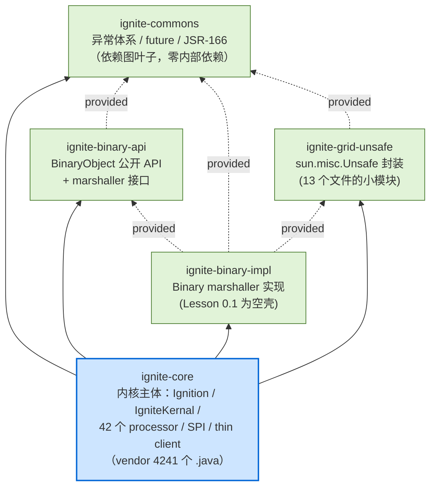
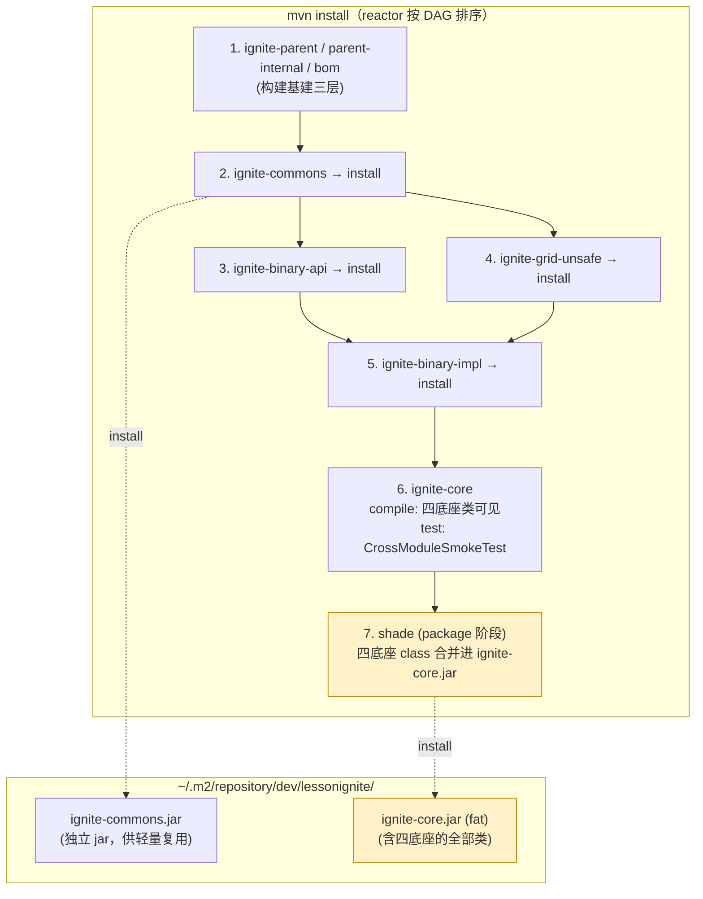
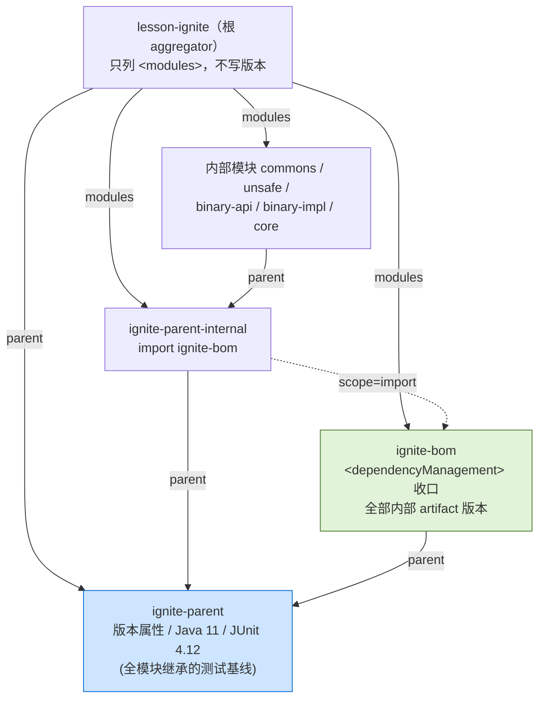

# Lesson 0.1 · 构建骨架：五模块 reactor 与 shade 协议

> 章节归属：章 0（构建骨架与 Ignition 生命周期）第 1 课 · ticket [#28](https://github.com/XianReallyHot-ZZH/Lesson-Ignite2/issues/28)
> 前置：无（本课是整个课程的第一课）
> 产出：镜像 2.18 拆分的 Maven reactor 空壳 + 四个锚点类 + JUnit 4 基线

## 0. 本课 Tracer 与验收结果

| 验收项 | 结果 |
|---|---|
| `mvn install` 全绿（9 个 reactor 模块） | ✅ BUILD SUCCESS |
| commons→core 跨模块冒烟（`CrossModuleSmokeTest`） | ✅ 2/2 |
| TDD 红绿切片 | ✅ 3 个切片全部先红后绿（17 个测试） |
| shade 产物核对：4 底座模块的类合并进 `ignite-core` fat jar | ✅ 逐类核对（命令见 §7） |

## 1. 为什么第一课是"搭骨架"而不是"写功能"

直觉上第一课应该从 `Ignition.start()` 写起。但本课程反其道而行，先花一课搭一个**空的多模块 Maven 工程**，理由有三：

1. **模块边界本身就是 2.18 的一课**。Apache Ignite 在 2.15～2.17 期间做了一系列拆分重构（IGNITE-2xxxx 系列），把原本的巨型 `ignite-core` 拆出 commons / binary-api / binary-impl / grid-unsafe 四个底座模块——然后又把它们 shade 回一个 fat jar。这个"拆了又合"的动作携带了 Ignite 工程上最重要的两个决策：**哪些代码属于公共底座**、**发布产物长什么样**。不从这里开始，后面每节课的代码都不知道往哪放。
2. **后期拆分是纯pom工程活且打乱包名布局**（ADR 0003 的 Considered Options 已否决"单模块起步"）。第一天就按终态布局，之后 96 节课再也不用动结构。
3. **每课完成打 tag，`git diff` 相邻 tag 就是教学增量**——这个机制需要一个稳定的地基才成立。

## 2. 2.18 的模块拆分：一张依赖图看懂

复刻的 reactor 镜像 vendor 的内核闭包（research 02 §5："被 shade 进 ignite-core jar 的那 5 个模块"）。箭头方向 `A --> B` = A 依赖 B；虚线 = `provided` scope：



每个模块一句话职责（与 vendor 源码包结构一一对应）：

| 模块 | 职责 | 0.1 时的状态 |
|---|---|---|
| `ignite-commons` | 异常体系（`IgniteCheckedException`）、`IgniteFuture`、`org.jsr166` 并发容器、工具类 | `IgniteCheckedException` + `X`（最小子集） |
| `ignite-grid-unsafe` | `GridUnsafe`（Unsafe 静态封装）、offheap、unsafe IO 流 | `GridUnsafe`（静态初始化子集） |
| `ignite-binary-api` | `BinaryObject`/`BinaryReader/Writer`、marshaller 接口、`CacheObject` 抽象 | `BinaryNameMapper`（纯接口） |
| `ignite-binary-impl` | `BinaryReaderExImpl`/`BinaryWriterExImpl` 等 marshaller 实现 | **空壳**（随 3.10 / 章 13 填充） |
| `ignite-core` | 内核主体（Ignition、processor、SPI、discovery/communication、thin client） | `IgniteState` 枚举 |

## 3. provided + shade：本课的核心概念簇

### 3.1 先理解问题：拆分与发布的矛盾

2.18 拆分四个底座模块的动机是**让客户端和其他组件能轻量复用**（比如 thin client 场景只需要 binary-api 的类型定义，不必拖走整个 90 万行内核）。但 Apache Ignite 的发布产物（用户从 Maven Central 拉的东西）**只有一个 `ignite-core` jar**——用户不希望 classpath 上多出四个小 jar。

于是协议变成：

- **Maven 视角**：5 个独立模块，各自有自己的坐标与 jar；
- **发布视角**：core 在打包期用 maven-shade-plugin 把四个底座模块的类**合并进自己的 jar**（vendor research 02 §4.1：`artifactSet` includes 四个底座）。

### 3.2 为什么底座之间全是 provided

`provided` 的语义是"编译期要、运行期假定别人给"。底座模块互为 provided 的原因：

1. **防止传递依赖膨胀**。若 binary-impl 以 compile 依赖 binary-api，那么任何依赖 binary-impl 的工程会传递拉进 binary-api——但既然发布产物只是 core fat jar，这些小 jar 根本不该出现在任何人的传递依赖里。
2. **运行期由 fat jar 提供**。shade 之后这些类全部活在 `ignite-core` jar 内部，运行期 classpath 上"提供者"是 core——这正是 provided 的字面语义。

### 3.3 为什么 core 必须用 compile

一个容易被忽略的机制点：**maven-shade-plugin 只处理 compile/runtime scope 的依赖**。core 若对底座也用 provided，shade 时四个底座根本不会被拉进来，fat jar 就是空的。所以协议的完整形状是：

```
底座之间：provided   （互相不传递）
core → 底座：compile （为了 shade 能拉进来）
```

### 3.4 从构建看数据流



注意一个实证过的坑：**单独 `mvn -pl modules/core test` 会从本地仓库解析旧版 commons**（上次 install 时的产物）。跨模块改动后要么从根构建，要么 `mvn -pl modules/core -am test` 让 reactor 把依赖模块一起构建——本课实施时就踩过一次（详见 §6 红绿记录）。

## 4. 构建基建三层：aggregator / parent / parent-internal / bom

vendor 用四个"无代码 pom"组织 39 个模块，复刻镜像了同样的三层（只是规模缩小到 8 个模块）：



各层职责（对照 vendor 同名 pom）：

| pom | 职责 | 关键机制 |
|---|---|---|
| 根 aggregator | 声明 reactor 模块清单 | `<packaging>pom</packaging>` + `<modules>`；自身 parent 指向 ignite-parent |
| `ignite-parent` | 全局基线：`maven.compiler.release=11`、UTF-8、**junit 4.12（test scope，全模块继承）** | `<dependencies>` 放在 parent 里 = 所有子模块自动获得 |
| `ignite-parent-internal` | 内部模块专用 parent | vendor 原注释："仅供源码树内部模块作 parent，永不发布"——扩展工程只 parent 到 ignite-parent，避免把内部依赖管理泄漏出去 |
| `ignite-bom` | 集中声明内部 artifact 版本 | `parent-internal` 以 `<scope>import</scope>` 引入；所以各模块 pom 里内部依赖**不写版本号** |

为什么需要 bom？看 unsafe 的 pom：`ignite-commons` 依赖没有 `<version>`——版本由 parent-internal → bom 的 import 链解析。增删模块版本只动 bom 一处（vendor 的 bom 收了 34 个 artifact，复刻先收 5 个）。

## 5. 复刻差异清单（教学取舍，均记录在 pom 头注释）

| # | 差异 | vendor 做法 | 复刻做法 | 理由 |
|---|---|---|---|---|
| 1 | **Maven groupId** | `org.apache.ignite` | `dev.lessonignite`（artifactId 不变） | `mvn install` 会把复刻 jar 写进本地仓库；若与 Apache 同坐标，会与本机任何真 Ignite 2.18.0 产物互相遮蔽（本地仓库优先于 Central）。**13.5 课官方 thin client 互操作需要从 Central 拉真 `org.apache.ignite:ignite-core`**，同坐标会静默拿错 jar。Java 包名仍是 `org.apache.ignite.*`（ADR 0001 包名 API 级准绳不受影响） |
| 2 | 版本表达 | `${revision}` + flatten-maven-plugin（CI-friendly） | 字面量 `2.18.0` | 复刻版本终生不变，flatten 的解析机制是纯发布工程，不属于本课概念簇 |
| 3 | codegen2 | 注解处理器生成消息序列化代码（provided） | 不复刻 | ADR 0002：消息序列化代码手写（学的是 Ignite 不是注解处理） |
| 4 | test-jar / antrun / deploy 配置 | core 打 test-jar、发布期属性注入 | 暂无 | 随需要再加（改写 vendor 测试跨模块共享时启用 test-jar） |
| 5 | log4j-bom import | parent-internal 同时 import log4j-bom | 暂无 | 复刻还没有 log4j 依赖 |

## 6. 本课代码地图与红绿记录

四个锚点类（每个类头部都有 `// 对应 vendor: ...` 锚点注释）：

| 类 | 模块 | vendor 锚点 | 0.1 子集 |
|---|---|---|---|
| `IgniteCheckedException` | commons | `modules/commons/.../org/apache/ignite/IgniteCheckedException.java` | 完整（构造器五件套 + `hasCause`/`getCause(Class)` + `toString`） |
| `X`（typedef） | commons | `modules/commons/.../internal/util/typedef/X.java` | 仅 `hasCause`/`cause` + 私有 `searchForCause`（遍历序与 vendor 一致：自身→cause 链→suppressed，IdentityHashMap 防环） |
| `GridUnsafe` | unsafe | `modules/unsafe/.../internal/util/GridUnsafe.java` | 静态初始化（`Unsafe.getUnsafe()` → SecurityException → 反射 `theUnsafe`，vendor 同路径）+ `NATIVE_BYTE_ORDER`/`BIG_ENDIAN` |
| `BinaryNameMapper` | binary-api | `modules/binary/api/.../binary/BinaryNameMapper.java` | 完整（纯接口） |
| `IgniteState` | core | `modules/core/.../org/apache/ignite/IgniteState.java` | 完整（4 值枚举 + `fromOrdinal`） |

红绿切片（每片先写测试看红，再实现转绿）：

1. **commons**：`IgniteCheckedExceptionTest` 10 条（构造器语义 / hasCause 含自身 / `getCause(Class)` 返回同一实例 / toString 格式）→ 红（找不到符号）→ 实现两类 → 绿 10/10
2. **core**：`IgniteStateTest` 3 条 + `CrossModuleSmokeTest` 2 条（tracer：commons 类在 core 编译期+运行期可用）→ 红 → 实现 `IgniteState` → 绿 5/5（中途实证了 §3.4 的本地仓库旧 jar 坑）
3. **unsafe**：`GridUnsafeTest` 2 条（类加载触发反射获取 Unsafe、字节序常量与 JDK 一致）→ 红 → 实现 → 绿 2/2——顺带验证了 **`--release 11` 下 `sun.misc.Unsafe` 可编译**（ct.sym 收录了该 legacy API），这个假设成立意味着后续持久化课弧可以放心用 vendor 的 unsafe 代码路径

## 7. 常用命令

```bash
# 全量构建 + 安装到本地仓库（本课 tracer）
mvn install

# 只测某模块（跨模块改动后记得 -am）
mvn -pl modules/core -am test

# 核对 shade 产物（fat jar 应含四底座模块的类）
unzip -l modules/core/target/ignite-core-2.18.0.jar | grep -E "IgniteCheckedException|GridUnsafe|BinaryNameMapper"
```

## 8. 下一课预告

**0.2 入口与注册表**：`Ignition`/`IgnitionEx` 的 `grids` 注册表语义（重名抛异常 / `getOrStart` 幂等 / 并发）、`initializeConfiguration`（nodeId/工作目录/日志代理）。Spring 重载路径显式抛 `UnsupportedOperationException`——ADR 0001"未复刻 API 显式抛"原则的首次应用。本课的 `IgniteState` 枚举将在 0.2 的注册表里直接上岗。

## 9. 验收测试来源说明（课程纪律要求）

本课概念簇（构建骨架/工程协议）**vendor 无对应物**（决策票 #3 决议明示"验收来源：自写"），全部 17 条测试为自写红绿切片；断言语义以 vendor 同名类的实际行为为准绳（`IgniteState` 枚举序、`IgniteCheckedException` 构造器语义、`X.searchForCause` 遍历序），不引入任何未在 vendor 源码中确认的行为预期。
