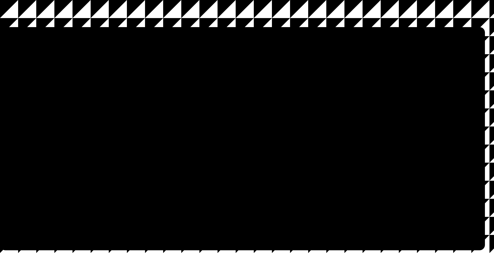
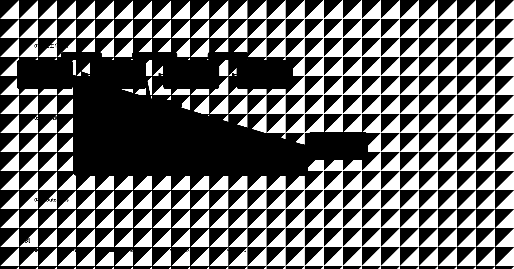

# Lesson 0.2 · 入口与注册表：Ignition / IgnitionEx

> 章节归属：章 0（构建骨架与 Ignition 生命周期）第 2 课 · ticket [#29](https://github.com/XianReallyHot-ZZH/Lesson-Ignite2/issues/29)
> 前置：Lesson 0.1（五模块 reactor 与锚点类）
> 产出：`Ignition`/`IgnitionEx` 入口与实例注册表、`initializeConfiguration` 配置定稿（0.2 切片）、Spring 入口显式排除（ADR 0001 首次应用）、最小 `IgniteKernal` 标识面

## 0. 本课 Tracer 与验收结果

| 验收项 | 结果 |
|---|---|
| 改写 vendor `GridGetOrStartSelfTest`（IGNITE-2941）：getOrStart 幂等 + 二次 start 抛异常 | ✅ 2/2 |
| 注册表语义自测 14 切片（重名/并发/失败回滚/nodeId/consistentId/workDir/logger/监听器/Spring 抛/按 ID 查找） | ✅ 14/14 |
| TDD 红绿切片 | ✅ 先红（找不到符号）后绿，两轮迭代 |
| 全 reactor `mvn install` | ✅ BUILD SUCCESS（33/33，含 0.1 的 17 个） |
| Spring 重载显式抛 `UnsupportedOperationException`（ADR 0001 首次应用） | ✅ 有测试守护 |

## 1. 为什么第二课是"注册表"而不是"把节点跑起来"

直觉上第二课应该直接把 `Ignition.start()` 一直写到能连集群。但拆开 vendor 的 `IgnitionEx.start0` 会发现：**在 kernal 存在之前，Ignite 先回答了三个问题**——

1. 一个 JVM 里可以有几个节点？（按名字任意多个，`null` 名为默认实例）
2. 两个线程同时启动同名节点，谁说了算？（注册表占位 + 定局等待）
3. 启动到一半失败了，名字还能不能用？（finally 摘除，立即可重启）

这三个问题与"节点做什么"完全正交，却决定了所有后续代码的入口形状。它们就是本课的概念簇——**入口与注册表**。kernal 容器（gateway 状态机、组件注册）是 0.3 的簇，此刻刻意不碰。

## 2. 0.2 的代码地形

（可交互版：缩放/主题切换/聚焦见 [assets/startup-slice.html](assets/startup-slice.html)；节点上带仓库文件锚点链接）



本课新增 27 个复刻类，按 vendor 的 2.18 模块归属落位（**类放哪个模块不是随意的——vendor 拆分时把无依赖的底座放 commons，入口与生命周期放 core**）：

| 模块 | 新增类 | 一句话职责 |
|---|---|---|
| commons | `IgniteException` / `IgniteInterruptedCheckedException` | 运行时/中断 checked 异常基类 |
| commons | `IgniteLogger` | 日志抽象接口（marker 默认方法与 vendor 一致） |
| commons | `IgniteBiTuple` / `T2` | 二元组（`start0` 的返回类型） |
| commons | `GridArgumentCheck` / `A` | "Ouch!" 风格参数校验 |
| commons | `CommonUtils` | home 解析 + `convertException`（checked→runtime） |
| commons | `IgniteCommonsSystemProperties` | sysprop/env 取值器（属性名在 core、取值在 commons——2.18 拆分的活化石） |
| commons | `GridConcurrentHashSet` | 监听器集合的并发容器 |
| core | `Ignite`（接口子集）/ `Ignition` / `IgnitionListener` | 公共门面：4 方法标识面 + 工厂方法 |
| core | `IgnitionEx` | **本课主役**：静态注册表 + `IgniteNamedInstance` 内部类 |
| core | `IgniteKernal` | 0.2 只做"标识面"（name/log/configuration/close/localNodeId），容器本体 0.3 接入 |
| core | `IgniteConfiguration` | 七字段子集 + 拷贝构造器（配置定稿的载体） |
| core | `GridLoggerProxy` / `JavaLogger` / `NullLogger` | 日志代理与两个实现 |
| core | `ShutdownPolicy` / `LifecycleAware` / `IgniteIllegalStateException` | 小件：停机策略枚举、生命周期接口、非法状态异常 |
| core | `IgniteSystemProperties` / `IgniteUtils`(`U`) / `G` | 常量名、工具底座、历史别名（`log.getLogger(G.class)` 的类别标记） |

## 3. 注册表语义：一图看懂并发仲裁

（可交互版见 [assets/start0-arbitration.html](assets/start0-arbitration.html)）


`start0(startCtx, failIfStarted)` 的骨架逐行对齐 vendor（IgnitionEx.java:1018-1119），四个关键机制：

### 3.1 占位即仲裁：`putIfAbsent`

```java
IgniteNamedInstance grid = new IgniteNamedInstance(name);
IgniteNamedInstance old;
if (name != null)
    old = grids.putIfAbsent(name, grid);      // 命名实例：map 原子占位
else {
    synchronized (dfltGridMux) {               // 默认实例没有 map 键，用互斥块等价
        old = dfltGrid;
        if (old == null)
            dfltGrid = grid;
    }
}
```

**先造壳、再占位、后启动**——注册表里放的是"还没启动的实例容器"，这一顺序是并发正确性的根：竞态只发生在占位一步，而 `ConcurrentHashMap.putIfAbsent` 把它原子化。

### 3.2 定局等待：`startLatch`

竞争者（输家）拿到 `old` 后调用 `old.grid()`——它不是启动线程，于是先 `U.awaitQuiet(startLatch)` 等赢家启动定局，再读到结果：

- 赢家成功 → `grid != null` → 按 `failIfStarted` 分流：`start` 抛 **already been started**，`getOrStart` 幂等返回既有实例；
- 赢家失败 → `grid == null`（"已停未摘"窗口）→ 原子替换占位再启动，替换失败说明又有第三个线程抢先 → **concurrently started**。

**竞争者永远不会观察到半启动状态**——这就是"实例级 STARTED"的可见性边界。

### 3.3 一开关两语义：`failIfStarted`

`Ignition.start(cfg)` 与 `Ignition.getOrStart(cfg)` 的全部差异收在 `start0` 的一个布尔参数上。测试改写自 vendor 的 `GridGetOrStartSelfTest`（IGNITE-2941，Apache 2.0 attribution 保留）。

### 3.4 失败回滚：`finally` 摘除

```java
finally {
    if (!success) {
        grids.remove(name, grid);   // 或 dfltGrid = null
        grid = null;
    }
}
```

启动抛任何异常，注册表槽位立即释放——**同名重启不需要等任何清理周期**（用例 `failedStartFreesRegistrySlot` 以非法 home 目录触发失败守护此不变量）。注意一个 vendor 同款副作用：`U.setIgniteHome(坏路径)` 发生在 home 校验之前，失败后 home 缓存已被污染，测试间需显式复位。

## 4. initializeConfiguration：配置定稿的 0.2 切片

`IgniteNamedInstance.start` 第一件正事是把用户配置变成**定稿副本**（`new IgniteConfiguration(cfg)` 拷贝构造器起头，用户手里的原配置此后不被改动）。0.2 完成的步骤与 vendor 顺序完全一致：

| 步 | 动作 | vendor 行 |
|---|---|---|
| 1 | `new IgniteConfiguration(cfg)` 拷贝 | IgnitionEx.java:1799 |
| 2 | home 解析：用户给 → `U.getIgniteHome()`；显式给则回写系统属性 | :1801-1808 |
| 3 | `U.workDirectory(userDir, home)` 四级解析：**用户配置 → 环境变量 `IGNITE_WORK_DIR` → `IGNITE_HOME/work` → `user.dir/ignite/work`** | :1810-1815 |
| 4 | `nodeId = cfg.getNodeId() != null ? : UUID.randomUUID()`——**nodeId 在进入 kernal 之前定稿** | :1822-1824 |
| 5 | `IGNITE_OVERRIDE_CONSISTENT_ID` 系统属性覆盖 consistentId | :1826-1829 |
| 6 | `U.initLogger`（无 logger 落 `JavaLogger`）→ `new GridLoggerProxy(cfgLog, null, name, U.id8(nodeId))` → 工厂日志取 `getLogger(G.class)` 类别 | :1831-1840 |
| 7 | 未显式给 workDir 时输出 "automatically resolved to" 告警 | :1842-1843 |
| 8 | home 目录存在性校验（不存在/不是目录 → `Invalid Ignite installation home folder`） | :1846-1850 |
| 9 | `userAttributes` 补空 Map 默认 | :1912-1913 |

**刻意未接入的步骤全部以注释标明归属课程**（方法尾部有一份汇总清单）：默认 SPI 注入是章 2、utility cache 追加是章 1、`DataStorageConfiguration` 是章 7、MBean 是 13.7……这就是 course-map 的**生长不变量**在代码里的形态：复刻的启动序列永远保持为 vendor §6 时间线的子序列，每课往里插回一段。

## 5. 生命周期与失败回滚（注册表视角）

（可交互版见 [assets/registry-lifecycle.html](assets/registry-lifecycle.html)）



两个容易混淆的状态层次：

| 层 | 类型 | 值 | 谁维护 |
|---|---|---|---|
| 实例状态 | `IgniteState`（0.1 已建） | STARTED / STOPPED（0.2 只用到这两个） | `IgniteNamedInstance.state` + `gridStates` 记忆 |
| kernal 内部状态 | `GridKernalState`（0.3 引入） | STOPPED/STARTING/STARTED/… | gateway 状态机 |

图中的 Registered/Starting 只是注册表**内部相位**，对外不可见。`stop()` 在 0.2 只做注册表侧动作（kernal 空停链 + 状态置 STOPPED + 摘除 + 通知监听器）；组件逆序停链、JVM shutdown hook、`STOPPED_ON_*` 终态分流都是 0.4 的概念簇。

## 6. ADR 0001 首次应用：Spring 入口显式抛

复刻范围排除 Spring（外围 17 模块之一），但"排除"不等于"静默缺失"——spec 用户故事 5 要求**未复刻的 API 显式抛 `UnsupportedOperationException`**，让复刻边界可被程序感知：

```java
public static Ignite start(String springCfgPath) throws IgniteException {
    throw new UnsupportedOperationException("Spring XML configuration entry points are out of the replica "
        + "scope (ADR-0001): use Ignition.start(IgniteConfiguration) instead.");
}
```

覆盖面：`start(String/URL/InputStream)` + `loadSpringBean` ×3；`localIgnite()`（等章 3 的 IgniteThread 基建）与 `startClient`（13.5 thin client）同法占位。连带的结构性差异：vendor 的 `IgniteKernal(GridSpringResourceContext)` 构造器与 `GridStartContext.springCtx` 字段在复刻中省参/省字段，均带 ADR 注释。用例 `springAndDeferredEntrypointsThrow` 守护。

## 7. 名字陷阱与对照纠偏（vendor 对照阅读指南）

1. **`grid()` vs `gridx()`**——vendor 有两个取实例方法：前者等待启动定局（非启动线程等 `startLatch`），后者立即返回可能为 null 的引用。公共 API 一律用前者；`gridx` 是给"已知道自己在干什么"的内部调用（如 `allGridsx`）。本课复刻两者 + `allGrids(boolean)` 三件套，顺序也对齐 vendor：**命名实例在前、默认实例排最后**。
2. **"已停未摘"窗口**——`stop()` 是先停 kernal、后摘注册表的两段动作，中间存在 `grid()==null` 但注册表仍有槽位的窗口。`start0` 的 replace 分支专门处理它（拿走旧壳换新壳），别把它当 bug。
3. **两层状态的命名误导**——`IgniteState.STOPPED` 与 0.3 将引入的 `GridKernalState.STOPPED` 同名不同物；vendor 源码里前者是工厂级（`Ignition.state()` 可见），后者是 kernal 级（gateway 内部）。
4. **`U` 不在 commons**——2.18 拆分后 `typedef.internal.U extends IgniteUtils`（core），而 `A` 在 commons：工具链是"core 蓄 commons 基类"的两层结构，别按直觉把 `U` 放进 commons。
5. **`IgnitionEx.getOrStart` 返回 `T2`**——公共的 `Ignition.getOrStart` 只返回 `Ignite`；带"本次是否真的启动"标志的 T2 形态是 vendor 内部 API（给测试与工具用），两者别混。
6. **deprecations**——vendor 的 `stop(name, cancel, stopNotStarted, timeoutMs)` 已 `@Deprecated`（超时杀 JVM 的激进语义），复刻未带；对照阅读时跳过即可。

## 8. 红绿记录与自检

红绿切片（先红后绿）：

| 切片 | 红 | 绿 |
|---|---|---|
| `GridGetOrStartSelfTest`（改写 vendor） | 编译失败：找不到 `Ignition`/`IgniteConfiguration` | 实现门面 + 注册表核心后 2/2 |
| `IgnitionStartRegistrySelfTest` 初版 | 14 用例中 2 红（sysprop 清理顺序、home 缓存污染） | 修测试自身的顺序问题后 14/14 |
| code-review 修复轮 | — | Standards 3 项 + Spec 4 项修复后复绿（见 §9） |

自检问题（做不出来就回看对应小节）：

1. 两个线程同时 `start` 同名配置，为什么输家不会读到半启动的实例？（§3.2）
2. `getOrStart` 与 `start` 在 `start0` 里的分叉点是哪一行？（§3.3）
3. `initializeConfiguration` 为什么必须先拷贝再改？（§4）
4. 启动失败后同名重启为何立即可行？代价是什么？（§3.4）
5. `Ignition.state("x")` 在实例从未启动、已停止两种场景各返回什么？（§5）

## 9. 与 ticket 的对账

- ✅ `Ignition`/`IgnitionEx`、grids 注册表语义（重名/getOrStart/并发）
- ✅ `initializeConfiguration`（nodeId/consistentId/工作目录/日志代理）
- ✅ Spring 重载显式抛（ADR 0001 首次应用）
- ✅ tracer：注册表语义测试（二次同名抛、getOrStart 幂等、nodeId 生成）
- ✅ 讲义本文件（中文、三张 archify 配图 + 可交互版）
- ✅ 新增复刻类 27 个全部带 vendor 锚点注释；git tag `lesson-0.2`

下一课（0.3 · kernal 容器）：`IgniteKernal` 长出 `IgniteEx` 接口、gateway 状态机、`GridKernalContextImpl`（`ctx.add`/comps 迭代）、`GridComponent` 先注册后启动契约，以及 Pool/Timeout/marshaller 三件套——tracer 升级为 **`Ignition.start(cfg)` 返回且 `Ignition.state()==STARTED`** + JdkMarshaller 往返点亮。
