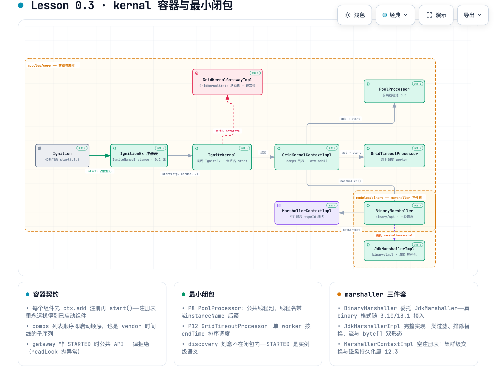
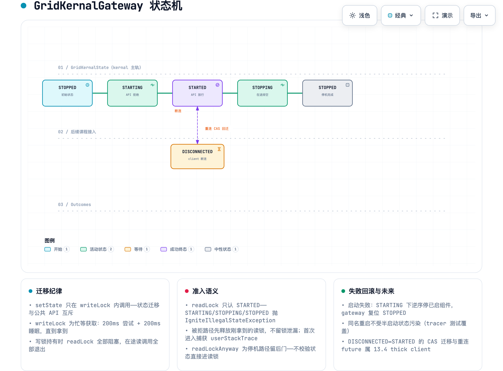
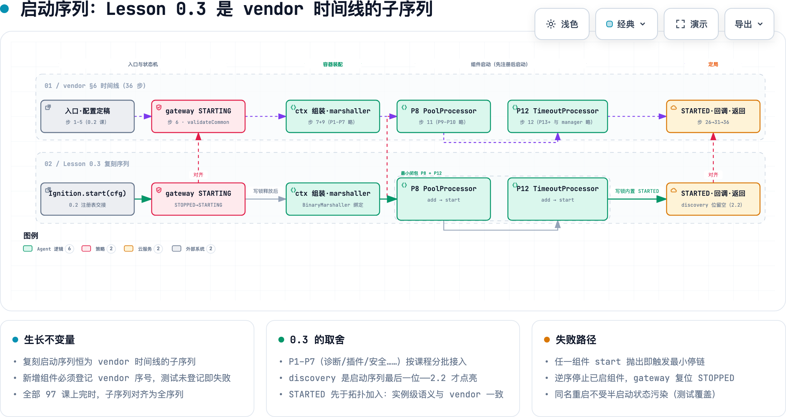

# Lesson 0.3 · kernal 容器与最小闭包

> 章节归属：章 0（构建骨架与 Ignition 生命周期）第 3 课 · ticket [#30](https://github.com/XianReallyHot-ZZH/Lesson-Ignite2/issues/30)
> 前置：Lesson 0.2（入口与注册表——`Ignition`/`IgnitionEx`、`initializeConfiguration`）
> 产出：`IgniteKernal` 容器本体（gateway 状态机 + `GridKernalContextImpl` + `GridComponent` 先注册后启动契约）、最小 processor 闭包（P8 Pool + P12 Timeout）、marshaller 三件套（`JdkMarshaller` 完整 + `BinaryMarshaller` delegate 占位 + 空注册表）

## 0. 本课 Tracer 与验收结果

| 验收项 | 结果 |
|---|---|
| **tracer**：`Ignition.start(cfg)` 返回且 `Ignition.state()==STARTED`；JdkMarshaller 往返 | ✅ 4/4（`IgniteKernalStartSequenceSelfTest`） |
| **生长不变量**：kernal 启动序列 == vendor §6 时间线子序列断言 | ✅ 子序列守卫落测试（新组件必须登记 vendor 序号） |
| 改写 vendor `GridTimeoutProcessorSelfTest`（超时/adapter 多线程/移除不触发/单次触发/同时刻/周期任务） | ✅ 7/7（Apache 2.0 attribution） |
| 自写切片：gateway 状态机 5 切片、pool 3 切片、marshaller 上下文 4 切片 | ✅ 12/12 |
| TDD 红绿切片 | ✅ 三波先红（找不到符号）后绿 |
| 全 reactor `mvn install` | ✅ BUILD SUCCESS（66/66：0.1+0.2 的 33 + 本课新增 33） |

## 1. 为什么第三课是"容器"而不是"缓存"

0.2 结束时，`Ignition.start()` 已经能返回一个"标识面" kernal——但它内部是空的：`start(cfg)` 只钉住配置。往任何方向走一步（下一课就要 put/get）都会撞上同样三个问题：

1. **一堆组件怎么共存？** 缓存、通信、discovery……每个都是几百上千行的 subsystem，谁持有谁、谁先启动？
2. **公共 API 什么时候才可调用？** `ignite.cache(name)` 在节点启动到一半时被调用会发生什么？
3. **启动到一半失败了怎么办？** 线程池已经建了、后台线程已经跑了，异常抛出后这些资源去哪？

vendor 对这三个问题的回答就是本课的概念簇——**kernal 容器**：

- 组件共存 → `GridKernalContextImpl` 的 `comps` 列表（注册表中的注册表）；
- API 可用性 → `GridKernalGateway` 状态机（读写锁守卫）；
- 失败恢复 → 最小停链（逆序 stop + gateway 复位）。

而"最小闭包"回答的是第四个隐含问题：**容器里先放什么？** vendor 启动 41 个 processor + 12 个 manager，第一课放两个——`PoolProcessor`（P8，几乎被所有后续组件依赖的线程池）和 `GridTimeoutProcessor`（P12，manager 们依赖的全局超时调度），外加 marshaller 三件套（序列化是后续一切跨时间/跨空间传递的底座）。**不含 discovery**——这是决策票 #3 的钉死项：`STARTED` 取实例级语义，vendor 分层事实是 `gw.setState(STARTED)` 先于拓扑加入（research 01 §3.7）。

## 2. 0.3 的代码地形

（可交互版：缩放/主题切换/聚焦见 [assets/kernal-container.html](assets/kernal-container.html)；节点带仓库文件锚点链接）



本课新增 **43 个主代码类 + 1 个 SPI 注册文件 + 7 个测试类**，修改 6 个既有类。落位与 vendor 的 2.18 模块归属严格一致：

| 模块 | 新增类 | 一句话职责 |
|---|---|---|
| commons | `IgnitePredicate` / `IgniteRunnable` / `GridAbsClosure` | 闭包底座（errHnd 参数、类过滤谓词） |
| commons | `IgniteThread` | 统一命名规则 `name-#N%instance%` 的 grid 线程 |
| commons | `CommonUtils` 增量 | 实例名 ThreadLocal、`forName` 类缓存、`loadService`、`currentTimeMillis` |
| unsafe | `GridByteArrayInputStream` / `GridByteArrayOutputStream` | 无同步 byte[] 流（marshaller 的缓冲层） |
| binary/api | `Marshaller` / `AbstractMarshaller` / `AbstractNodeNameAwareMarshaller` | 序列化接口栈（模板方法切实例名） |
| binary/api | `MarshallerContext` / `MarshallersFactory` / `Marshallers` / `MarshallerExclusions` | 上下文接口 + ServiceLoader 工厂 + 排除清单 |
| binary/api | `JdkMarshaller`（接口）/ `BinaryMarshaller`（delegate 占位）/ `IgniteUuid` | JDK 序列化入口 / binary 占位 / 快速 ID |
| binary/impl | `JdkMarshallerImpl` + 4 个流类 + `MarshallersFactoryImpl` + services 注册 | **JdkMarshaller 完整实现**（类过滤、排除替换、Dummy 占位） |
| core | `GridKernalState` / `GridKernalGateway(Impl)` | **gateway 状态机** |
| core | `GridComponent` / `GridProcessor` / `GridProcessorAdapter` | **组件契约**（先注册后启动） |
| core | `GridKernalContext(Impl)` / `IgniteEx` / `MarshallerContextImpl` | 组件注册表 / 扩展接口 / 空注册表 |
| core | `PoolProcessor` / `GridTimeoutProcessor`（+ Object/Adapter） | 最小闭包 P8 + P12 |
| core | `GridWorker` / `WorkersRegistry` / `TimeBag` / `GridConcurrentSkipListSet` | worker 底座 / 注册表 / 计时袋 / 有序集 |
| core | `IgniteThreadFactory` / `IgniteThreadPoolExecutor` | 线程池设施 |
| core 修改 | `IgniteKernal`（容器化）/ `IgnitionEx`（全签名 start）/ `IgniteConfiguration`（公共池大小）/ `IgniteUtils`/`X` 增量 | 本课主役 |

**api/impl 拆分是 2.18 的真实结构**：vendor 把 marshaller 接口放 binary/api、实现放 binary/impl，用 JDK `ServiceLoader`（`META-INF/services`）跨模块发现——复刻原样照搬，`Marshallers.jdk()` 经 `CommonUtils.loadService` 找到 impl 模块的 `MarshallersFactoryImpl`。这条 SPI 通道在 12.x 部署课会再次出现。

## 3. gateway 状态机：公共 API 的守门人

（可交互版见 [assets/gateway-state-machine.html](assets/gateway-state-machine.html)）



`GridKernalGatewayImpl` 是一把带状态的读写锁：

- **readLock**：每个公共 API 调用进入时获取。**只认 STARTED**——STARTING/STOPPING/STOPPED 一律抛 `IgniteIllegalStateException`，且被拒路径会先释放刚拿到的读锁（不留锁泄漏），首次进入还顺手捕获 userStackTrace（诊断"谁在停机时还持着读锁"）。
- **readLockAnyway**：停机路径专用后门——不校验状态直接进读锁（stop 时组件还要做清理收尾）。
- **writeLock**：忙等获取（200ms 尝试 + 200ms 睡眠直到拿到——vendor 原样），持有期间全部 readLock 阻塞。**setState 只允许在写锁内调用**：状态迁移与公共 API 互斥。

两条铁律的分层答案（"什么算 started"——research 01 §3.7 表）在本课点亮了中间三层：

| 层 | 信号 | 本课状态 |
|---|---|---|
| 组件级 | 全部 manager/processor 的 `start()` 与 `onKernalStart()` 跑完 | ✅ 最小闭包两个组件 |
| kernal 级 | gateway state = STARTED | ✅ 步 26 前半 |
| 实例级 | `IgniteNamedInstance.state = STARTED`、startLatch 归零 | ✅（0.2 已有） |
| 工厂级 | `notifyStateChange(STARTED)` → `Ignition.state()` 可见 | ✅（0.2 已有） |
| 集群级 | 本地 join 完成（拓扑事件） | ⬜ 章 2（discovery 位刻意留空） |

## 4. 启动序列与生长不变量

（可交互版见 [assets/startup-subsequence.html](assets/startup-subsequence.html)）



本课的启动序列是 vendor 36 步时间线（research 01 §6）的**子序列**：

```
gateway STOPPED→STARTING（vendor 步 6）
→ GridKernalContextImpl 组装（步 7）
→ initializeMarshaller：BinaryMarshaller 绑定上下文与实例名（步 9）
→ P8 PoolProcessor：ctx.add → start()（步 11 内）
→ P12 GridTimeoutProcessor：ctx.add → start()（步 12 内）
→ gw.setState(STARTED)（步 26 前半；discovery 最后启动位留给 2.2）
→ 全部组件 onKernalStart(true) 回调（步 31）
```

**先注册后启动**是贯穿全程的契约：`startProcessor` 先 `ctx.add(proc)` 再 `proc.start()`——避免"组件已启动但注册表查不到"的窗口（vendor `IgniteKernal.java:1695-1704` 原语义）。这保证了 `comps` 列表顺序同时是注册序和启动序。

**生长不变量**（后续每课的固定断言，`IgniteKernalStartSequenceSelfTest` 守卫）：

- 测试内置 vendor 时间线序号表（当前 `{PoolProcessor: 8, GridTimeoutProcessor: 12}`）；
- 启动后遍历 `ctx.components()`，每个组件必须在序号表登记（**未登记即测试失败**——新课加组件时的强制登记纪律）；
- 序号必须严格递增（子序列性质）；
- 全部 97 课上完时，子序列自然对齐为全序列。

## 5. marshaller 三件套

| 件 | 形态 | 接入课程 |
|---|---|---|
| `Marshaller` / `MarshallerContext` 接口 | 完整（vendor 原签名） | — |
| `JdkMarshaller` | **完整实现**：`ObjectOutputStream` 包装（排除类替换 null、裸 Object 换 Dummy）、`ObjectInputStream` 包装（`CommonUtils.forName` + 类名过滤器 + 类缓存）、流与 byte[] 双形态、实例名感知（模板方法切 ThreadLocal） | — |
| `BinaryMarshaller` | **delegate 占位**：marshal/unmarshal 全部委托 JdkMarshaller；`ctx.marshaller()` 通道立即可用 | 真 binary 线协议 → 3.10 / 13.1 |
| `MarshallerContextImpl` | **空注册表**：本地 `typeId→类名` ConcurrentHashMap 闭环 | 集群级交换 + 磁盘持久化 → 12.3 |

`AbstractNodeNameAwareMarshaller` 的模板方法值得一看：每次 marshal/unmarshal 前后切换/恢复线程局部实例名，使序列化路径能感知"当前为哪个实例工作"——这是 `Ignition.localIgnite()` 类能力的底座。类名过滤（`IgnitePredicate<String>`）是反序列化攻击面的第一道闸：非信任类名直接 CNFE。

## 6. 失败路径与最小停链

vendor 的失败处理一句话：**catch Throwable → 记日志 → `errHnd.apply()` → `stop(true)` → 重抛**。本课照搬形态，`stop0` 为最小停链：

```
gw.writeLock()
→ gw.setState(STOPPING)
→ 逆序 comps.stop(cancel)   // 半启动组件的 stop 必须幂等（PoolProcessor 停未建池=无操作）
→ ctx = null
→ gw.setState(STOPPED)
→ gw.writeUnlock()
```

正式 `stop(boolean)` 与启动失败回滚**共用同一条链**（vendor 同构：catch 里调的就是 `stop(true)`）。完整停链的其余部分——组件 `onKernalStop` 通知、生命周期 bean `AFTER_NODE_STOP`、JVM shutdown hook、注册表摘除联动——是 0.4 的概念簇。tracer 测试同时覆盖了"失败后同名重启不受半启动状态污染"和"正式停止后 gateway 复位 STOPPED、worker 线程退出"两条路径。

## 7. 与 vendor 的显式差异（本课全部备案）

| 差异 | 原因 | 归属课程 |
|---|---|---|
| gateway 用 `ReentrantReadWriteLock`（vendor 为 StripedCompositeReadWriteLock 分条锁） | 读锁竞争优化，语义等价 | 通信章压力场景再评估 |
| `GridKernalGateway` 接口无 `onDisconnected/onReconnected` | 依赖 reconnect future 基础设施 | 13.4 thick client |
| `GridComponent` 无 discovery 数据交换六方法 + 断连两方法 | discovery 尚未到课 | 章 2 / 章 13 |
| ctx 构造器裁剪 plugins/clsFilter/pauseDetector 参数 | 各自子系统未到课 | 插件课 / 12.3 / 运维面 |
| `PoolProcessor` 只有公共池（vendor 17 个池 + 饥饿检测 + metrics） | 逐池随消费者课程接入 | 3（svc/sys/striped）、11.9（datastream）、8（qry）…… |
| `GridTimeoutProcessor` 无 `waitAsync`（future 桥接）与心跳/失败上报 | future 基础设施与 FailureProcessor 未到课 | future 课 / FailureProcessor 课 |
| `IgniteKernal.context()` 返回 `GridKernalContextImpl`（协变收窄） | kernal 内部与测试直接用 `add()` | 长期（已备案） |
| `TimeBag` 只有全局阶段（vendor 另有本地阶段聚合） | 启动路径只用全局阶段 | 细粒度计时需求出现时补 |
| `MarshallerContextImpl` 无系统类型表/磁盘/集群通道 | 空注册表约束（票 #2/#3） | 13.1 / 12.3 |
| `BinaryMarshaller` delegate 到 JdkMarshaller | 占位约束（票 #2） | 3.10 / 13.1 |

## 8. 自测指南

```bash
mvn install                        # 全 reactor 66/66
mvn -pl modules/core test -Dtest=IgniteKernalStartSequenceSelfTest   # tracer + 生长不变量
mvn -pl modules/binary/impl test -Dtest=JdkMarshallerSelfTest        # JdkMarshaller 往返
```

测试来源说明：`GridTimeoutProcessorSelfTest` 改写自 vendor 同名测试（`modules/core/src/test/.../timeout/GridTimeoutProcessorSelfTest.java`，Apache 2.0）；`GridTestKernalContext` 镜像 vendor 测试框架同名类的 start/stop 迭代语义；其余为自写切片（tracer、gateway、pool、marshaller 上下文、失败回滚/停链）。

## 9. 下一课预告

**0.4 生命周期收口**：`stop()` 完整停链（`onKernalStop` 通知、生命周期 bean `BEFORE/AFTER_NODE_STOP`、JVM shutdown hook、状态枚举全迁移）——tracer 是 start→stop→同名 restart。本课刻意留下的 `stopping` 状态轨、`readLockAnyway` 的后门、`LifecycleAware` 接口（0.1 已就位）都将在那里收拢。
